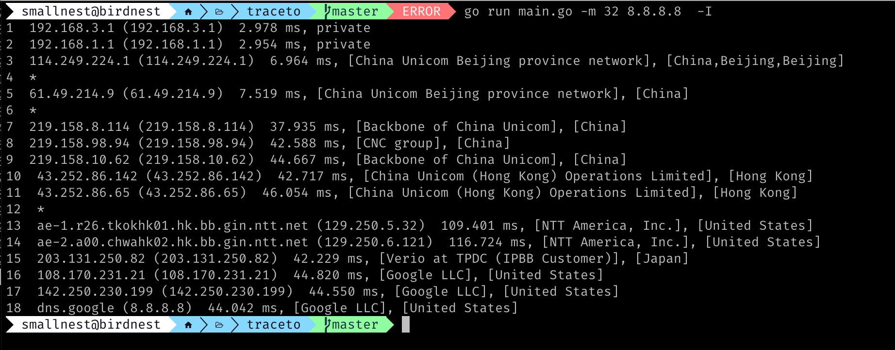

# traceto
traceroute with Geographic information


run it:
```sh
./traceto -I 8.8.8.8
```




## geoip


It uses the free geoip database [geoip2](http://dev.maxmind.com/geoip/geoip2/geolite2/) and embeds it in the binary whn you build the binary.
So the binary is portable but it is a little bigger.